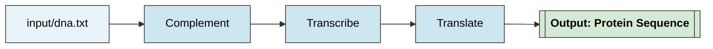

# Automatización y Escalabilidad Elástica de Pipelines Bioinformáticos con Nextflow y Cloud Computing

**Curso: 2025**

**Integrantes:**

* Javier Alejandro Di Salvo [@JavierBioinformatic](https://github.com/JavierBioinformatic)
* Gisela Pattarone
* Federico Trotta

---

# DNA Processing Pipeline

Pipeline desarrollado en **Nextflow (DSL2)** para procesar secuencias de ADN a través de tres etapas secuenciales:
**Complementación**, **Transcripción** y **Traducción**.

Cada etapa se ejecuta en un entorno reproducible mediante contenedores **Docker** construidos localmente con soporte para **BioPython**.

---

## Objetivo del proyecto

Implementar un pipeline bioinformático **modular, reproducible y portable** que permita transformar una secuencia de ADN en su:

1. **Cadena complementaria**
2. **Secuencia de ARN mensajero (transcripción)**
3. **Secuencia proteica (traducción)**

El flujo demuestra principios de **Nextflow DSL2 modular**, **contenedores Docker** y **BioPython**, aplicados al procesamiento básico de secuencias biológicas.

---

## Descripción del flujo de trabajo

| Proceso      | Descripción                               | Script asociado         | Módulo Nextflow         | Entrada                | Salida                |
| ------------ | ----------------------------------------- | ----------------------- | ----------------------- | ---------------------- | --------------------- |
| `complement` | Genera la secuencia complementaria de ADN | `scripts/complement.py` | `modules/complement.nf` | `input/dna.txt`        | Cadena complementaria |
| `transcribe` | Transcribe el ADN a ARN                   | `scripts/transcribe.py` | `modules/transcribe.nf` | Output de `complement` | Cadena de ARN         |
| `translate`  | Traduce la secuencia de ARN en proteína   | `scripts/translate.py`  | `modules/translate.nf`  | Output de `transcribe` | Secuencia proteica    |

---

## Diagrama del pipeline



---

## Estructura del proyecto

```
Automatizacion_escalabilidad_UnLu/
├── dna-pipeline/
│   ├── input/
│   │   └── dna.txt
│   ├── modules/
│   │   ├── complement.nf
│   │   ├── transcribe.nf
│   │   └── translate.nf
│   ├── scripts/
│   │   ├── complement.py
│   │   ├── transcribe.py
│   │   └── translate.py
│   ├── Dockerfile
│   └── main.nf
├── nextflow.config
├── .gitignore
└── README.md
```

---

## Uso de contenedores

El pipeline utiliza una **imagen Docker local personalizada** basada en `python:3.9-slim` que instala **BioPython** y dependencias del sistema.

**Dockerfile utilizado:**

```dockerfile
FROM python:3.9-slim

# Utilidades requeridas por Nextflow para recolectar métricas
RUN apt-get update && apt-get install -y procps && rm -rf /var/lib/apt/lists/*

# Instalación de BioPython
RUN pip install --no-cache-dir biopython

WORKDIR /data
```

Construcción de la imagen local:

```bash
cd dna-pipeline
docker build -t biopython_local:latest .
```

---

## Ejecución del pipeline

### 1. Clonar el repositorio

```bash
git clone <URL-del-repo>
cd Automatizacion_escalabilidad_UnLu
```

### 2. Ejecutar con Docker

```bash
nextflow run ./dna-pipeline/main.nf -with-docker -with-report -with-timeline -with-trace
```

> **Nota:** chequear de que el servicio Docker esté activo (`sudo service docker start`)
> y que la imagen `biopython_local:latest` exista localmente (`docker images`).

---

## Reportes automáticos generados

| Reporte      | Descripción                                     | Archivo generado    |
| ------------ | ----------------------------------------------- | ------------------- |
| **Trace**    | Registro detallado de procesos y recursos       | `trace-<fecha>.txt` |
| **Report**   | Informe HTML del flujo completo                 | `report.html`       |
| **Timeline** | Visualización temporal de las tareas ejecutadas | `timeline.html`     |

---

## Escalabilidad

El pipeline soporta múltiples archivos de entrada en paralelo:

```bash
dna-pipeline/input/
├── dna_1.txt
├── dna_2.txt
└── dna_3.txt
```

Cada secuencia genera sus resultados independientes, demostrando escalabilidad horizontal.

---

## Dependencias

* **Nextflow ≥ 24.10.0**
* **Docker ≥ 24.0.0**
* **Python ≥ 3.9** (dentro del contenedor)
* **BioPython** (instalado en la imagen Docker)

---

## Créditos

Trabajo Final Integrador
**“Automatización y Escalabilidad Elástica de Pipelines Bioinformáticos con Nextflow y Cloud Computing”**

Autores:

* Javier Alejandro Di Salvo
* Gisela Pattarone
* Federico Trotta
